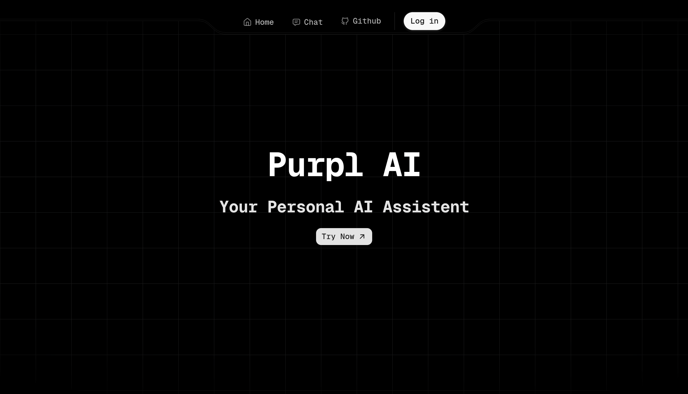

# Purpl

**An AI-powered chat app with web search integration.**

you ask something, it searches the internet in real time, and gives you an answer with sources. Built with Google Gemini + Tavily web search.

> It's currently designed to work with **GitHub login only** (via Supabase Auth).

screenshots/link/video :

- Screenshots are given in the very bottom of the readme.
- Live frontend only link : [Link](https://purpl-h4oy.vercel.app/) (Backend doesn't work in production yet :] )
- full working site gdrive video : [Link](https://drive.google.com/file/d/1bznM4ZXO8g3BO4F-9QRhZAdINNsXtbTy/view?usp=sharing)  

---

## Tech Stack

| Layer | What it uses |
|-------|-------------|
| **Frontend** | Next.js + React + Tailwind CSS (shadcn/ui + vengenceUI) |
| **Backend** | Express + Drizzle ORM |
| **Database** | PostgreSQL hosted on Supabase |
| **Auth** | Supabase Auth (GitHub OAuth) |
| **AI** | Google Gemini (`gemini-3-flash-preview`) |
| **Web Search** | Tavily API |

---

## Local Setup Guide

This guide will help you setup this project on your local computer.

### Required Packages

- [Node.js](https://nodejs.org/) (v18 or newer)
- [Bun](https://bun.sh/) — the backend runs on this (not npm)
- A [Supabase](https://supabase.com/) account (free tier is fine)
- A [GitHub](https://github.com/) account (for OAuth)
- A [Google AI Studio](https://aistudio.google.com/) account (for Gemini API key, free tier is fine)
- A [Tavily](https://tavily.com/) account (for web search API key, its free too dw)

---

### Step 1 — Clone the repo

> Don't use the main branch, only use the "local" branch to use or test this project.

```bash
git clone -b local https://github.com/meharwanfr/purpl
cd purpl
```

---

### Step 2 — Set up Supabase

- There's a template .env file given below for both backend and frontend, get em and put it in your /frontend and /backend folder's root.

Create a project on [supabase.com](https://supabase.com/). After it's created, grab three things from your project dashboard:


- To Get SUPABASE_API_SECRET_KEY : Click Connect on your supbase dashboard's navbar, then Choose Server, then Scroll Down to find SUPABASE_SECRET_KEY variable, use this value.

- To Get DATABASE_URL : copy the Direct Connection String from the Dashboard (if you click that copy on dashboard, you should see it)

- To Get SUPABASE_PROJECT_URL :  copy the Project Url from the Dashboard


---

### Step 3 — Set up GitHub OAuth

1. Go to **GitHub Settings → Developer settings → OAuth Apps → New OAuth App**
2. Fill in:
   - **Application name**: Purpl (or whatever you prefer)
   - **Homepage URL**: `http://localhost:3000`
   - **Authorization callback URL**: `https://<your-supabase-project-ref>.supabase.co/auth/v1/callback`
3. Hit **Register application**
4. Copy the **Client ID** and **Client Secret**

**In Supabase Dashboard → Authentication → Providers:**
- Enable **GitHub**
- Paste the **Client ID** and **Client Secret** from GitHub

**In Supabase Dashboard → Authentication → Settings:**
- **Site URL**: `http://localhost:3000` (for local dev)
- **Redirect URLs**: add `http://localhost:3000/auth/callback`

---

### Step 4 — Get API keys

| Service | Where to get it |
|---------|----------------|
| **Gemini** | [Google AI Studio](https://aistudio.google.com/) → Get API key (free tier) |
| **Tavily** | [Tavily Dashboard](https://app.tavily.com/) → API keys (free tier exists) |

---

### Step 5 — Configure environment variables

#### Backend (`backend/.env`)

Open `backend/.env` and fill in your real values:

```env
DATABASE_URL=postgresql://postgres:<password>@aws-0-<region>.pooler.supabase.com:6543/postgres?pgbouncer=true
SUPABASE_PROJECT_URL=https://<your-project>.supabase.co
SUPABASE_API_SECRET_KEY=sb_secret_<your-service-role-key>
GITHUB_OAUTH_CLIENT_ID=<from-github-oauth-app>
GITHUB_OAUTH_SECRET=<from-github-oauth-app>
FRONTEND_URL=http://localhost:3000
TAVILY_API_KEY=<from-tavily>
GEMINI_API_KEY=<from-google-ai-studio>
```

#### Frontend (`frontend/.env`)

Open `frontend/.env` and fill in:

```env
NEXT_PUBLIC_SUPABASE_URL=https://<your-project>.supabase.co
NEXT_PUBLIC_SUPABASE_PUBLISHABLE_KEY=<anon-public-key-from-supabase>
NEXT_PUBLIC_LOCAL_BACKEND_API=http://localhost:3001
NEXT_PUBLIC_LOCAL_SITE_URL=http://localhost:3000
```

---

### Step 6 — Install dependencies

Open **two terminals** — you'll need both running at once.

**Terminal 1 — Backend:**

```bash
cd backend
bun install
```

**Terminal 2 — Frontend:**

```bash
cd frontend
npm install
```

---

### Step 7 — Run database migrations

This creates the tables in your Supabase database (users, conversations, messages):

```bash
cd backend
bunx drizzle-kit push
```

You should see something like:
```
✓ No config changes
✓ Pulling schema... done
```

If you get connection errors, check your `DATABASE_URL` — make sure the password is correct.

---

### Step 8 — Start the servers

**Terminal 1 — Backend** (it runs on port 3001):

```bash
cd backend
bun run dev
```

You should see:
```
Server started on port 3001
Database is connected successfully
```

> If you get in any wierd trouble, don't hesitate or raise an issue on this repo or just dm me on my socials (@meharwanfr on x/twitter).

**Terminal 2 — Frontend** (it runs on port 3000):

```bash
cd frontend
npm run dev
```

Open [http://localhost:3000](http://localhost:3000) — you should see the landing page.

---

### Step 9 — Sign in and chat

1. Click **Try Now**
2. Click **Sign In With GitHub**
3. Authorize the app
4. You'll be redirected to the chat page
5. Type anything — the AI will search the web and respond with sources

---

## Project structure

```
purpl/
├── backend/                # Main backend code
│   ├── index.ts            # Main server file (routes + controllers)
│   ├── middleware.ts       # Auth middleware (checks JWT)
│   ├── client.ts           # Supabase admin client
│   ├── prompts.ts          # Gemini system prompt + template
│   ├── src/db/schema.ts    # Database schema + relations (Drizzle)
│   ├── drizzle/            # Migration files
│   └── .env                # Backend environment variables
│
├── frontend/               # Next.js app
│   ├── app/                # App router pages
│   │   ├── page.tsx        # Landing page
│   │   ├── auth/           # Sign-in page + callback
│   │   └── chat/           # Main chat interface
│   ├── components/         # UI components (shadcn + vengenceUI)
│   ├── lib/                # Supabase client helpers
│   ├── proxy.ts            # Auth middleware (Next.js)
│   └── .env                # Frontend environment variables
│
└── README.md               # Readme file
```

## Screenshots




## Motivation

I made this project to learn more about generative ai and how how these chatbots (that i daily use) are made and how complex they can actually go. this project is NOT a production ready chat app yet and needs polishing over time. my objective was to just learn more about these ai powered full stack apps.    


## AI Usage
AI was mostly used to diagnose code while deploying on vercel and general querying or doubt solving for backend api's and shadcn/ui usage bugs.

---

thanks for looking into my project. this project is made for the [Horizons](https://horizons.hackclub.com/) event organised by Hack Club.
tree -I 'node_modules'