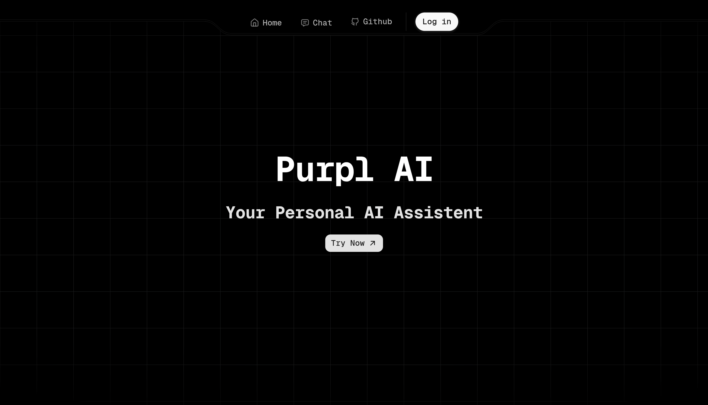

# Purpl AI 

An ai chatbot which you can just chill chat or ask some research related questions and also gives official site sources where it fetches the data from , so the responses are pretty accurate (mostly, still check official sources on your own just in case). 

- Also, please look into the server branch for source code review, not the main branch.

# Live Demos : ([Live_link](https://purpl-h4oy.vercel.app)) 

- also some screenshots of the ui 

---
